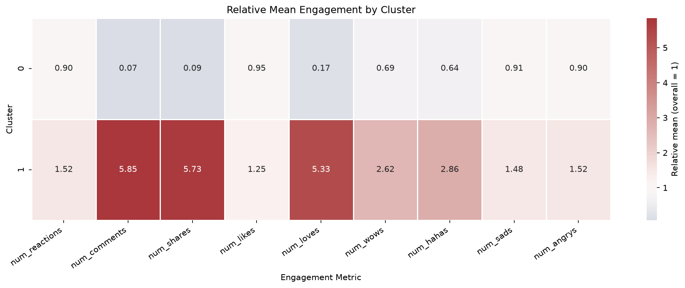
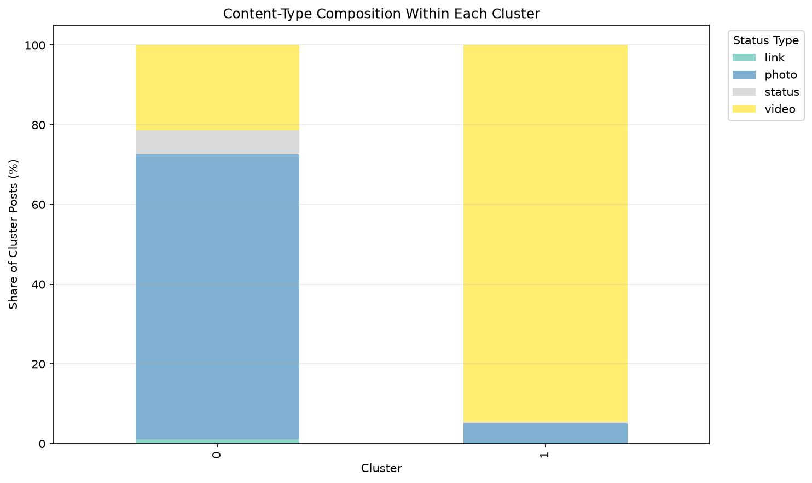

# Facebook Engagement Clustering

[](https://www.python.org/)
[](https://docs.astral.sh/uv/)
[](https://scikit-learn.org/)
[](https://archive.ics.uci.edu/dataset/488/facebook+live+sellers+in+thailand)
[](https://github.com/Giovannipersio/facebook-engagement-clustering)

An end-to-end unsupervised machine learning project that identifies and
interprets engagement patterns in Facebook posts published by Thai fashion and
cosmetics sellers.

The project collects the UCI dataset, builds a validated modeling matrix,
reduces its dimensionality with PCA, compares three clustering families, tests
assignment stability, and translates the selected groups into content and
engagement profiles.

## Project Objective

The objective is to discover groups of posts with similar behavior using:

- reactions, comments, and shares;
- the composition of Facebook reactions;
- publication type;
- month, weekday, and time of publication.

This is an exploratory segmentation task. Cluster membership describes
patterns in the observed data and does not establish causal effects.

## Key Results

| Item | Result |
| --- | ---: |
| Observations | 7,050 |
| Modeling features | 19 |
| PCA components retained | 10 |
| Cumulative variance retained | 87.79% |
| Candidate configurations evaluated | 122 |
| Selected model | Agglomerative Clustering |
| Selected number of clusters | 2 |
| Silhouette Score | 0.364 |
| Mean perturbation ARI | 0.967 |

The solution is stable under small perturbations but strongly imbalanced. Its
Silhouette Score indicates moderate separation, so the profiles should be
interpreted together with cluster sizes and domain context.

| Cluster | Posts | Share | Typical profile |
| ---: | ---: | ---: | --- |
| 0 | 5,913 | 83.87% | Lower typical engagement; 71.54% photos |
| 1 | 1,137 | 16.13% | Higher comments and shares; 94.55% videos |

Content type has a strong association with cluster membership
(`Cramér's V = 0.573`). Weekday and publication daypart have negligible
associations in this sample.





## Workflow

```mermaid
flowchart LR
    UCI["UCI dataset 488"] --> N1["01 Collection and understanding"]
    N1 --> RAW["Raw data"]
    RAW --> N2["02 Preprocessing"]
    N2 --> MATRIX["Validated model matrix"]
    MATRIX --> N3["03 PCA"]
    N3 --> SCORES["10-component PCA scores"]
    SCORES --> N4["04 Model comparison"]
    N4 --> LABELS["Selected cluster labels"]
    LABELS --> N5["05 Analysis and conclusion"]
    N5 --> REPORTS["Profiles, figures, and conclusions"]
```



| Notebook | Responsibility | Main outputs |
| --- | --- | --- |
| [01 — Data collection and understanding](notebooks/01_data_collection_and_understanding.ipynb) | Download and validate the UCI feature table | Raw dataset |
| [02 — Data preprocessing](notebooks/02_data_preprocessing.ipynb) | Engineer temporal features, encode categories, transform skewed variables, and validate the matrix | Cleaned data, model matrix, fitted preprocessor |
| [03 — Dimensionality reduction](notebooks/03_dimensionality_reduction.ipynb) | Select and interpret the PCA representation | PCA scores, variance table, component weights, fitted PCA |
| [04 — Clustering model comparison](notebooks/04_clustering_model_comparison.ipynb) | Evaluate K-Means, Agglomerative Clustering, and DBSCAN under quality and stability rules | Candidate metrics, selected labels, fitted model |
| [05 — Cluster analysis and conclusion](notebooks/05_cluster_analysis_and_conclusion.ipynb) | Profile the selected groups and document conclusions and limitations | Cluster profiles, association measures, final figures |

## Repository Structure

```text
facebook-engagement-clustering/
|-- artifacts/                     # Fitted preprocessing and model objects
|-- data/
|   |-- raw/                       # Collected source snapshot
|   `-- processed/                 # Reproducible analytical datasets
|-- docs/
|   |-- data-and-artifacts.md      # Data dictionary and output catalog
|   |-- methodology.md             # Detailed analytical decisions
|   `-- results-and-limitations.md # Interpretation and responsible-use notes
|-- notebooks/
|   |-- 01_data_collection_and_understanding.ipynb
|   |-- 02_data_preprocessing.ipynb
|   |-- 03_dimensionality_reduction.ipynb
|   |-- 04_clustering_model_comparison.ipynb
|   `-- 05_cluster_analysis_and_conclusion.ipynb
|-- reports/figures/               # Generated visual diagnostics
|-- src/                           # Reusable, domain-independent utilities
|-- .python-version
|-- pyproject.toml
|-- uv.lock
`-- README.md
```

## Reproduce the Project

### Prerequisites

- Git;
- [uv](https://docs.astral.sh/uv/).

The required Python version and all direct dependencies are declared in the
project files. A separate manual Python installation is usually unnecessary
because uv can install the requested interpreter.

### 1. Clone the repository

```bash
git clone https://github.com/Giovannipersio/facebook-engagement-clustering.git
cd facebook-engagement-clustering
```

### 2. Create and synchronize the environment

```bash
uv sync --locked
```

This creates `.venv` and installs the exact versions recorded in `uv.lock`.

### 3. Start JupyterLab

```bash
uv run jupyter lab
```

In VS Code, select the interpreter inside `.venv` as the notebook kernel:

- Windows: `.venv/Scripts/python.exe`
- Linux or macOS: `.venv/bin/python`

### 4. Run the notebooks in order

```text
01_data_collection_and_understanding.ipynb
02_data_preprocessing.ipynb
03_dimensionality_reduction.ipynb
04_clustering_model_comparison.ipynb
05_cluster_analysis_and_conclusion.ipynb
```

Each notebook validates the artifacts it consumes and saves the outputs needed
by the next stage. Operational messages use structured logging, while tables
and plots remain notebook outputs.

## Methodological Safeguards

- Raw and processed tables are joined through a persistent `record_id` with
  one-to-one validation.
- Missing values, duplicated columns, negative engagement counts, and infinite
  model values are checked explicitly.
- Exact feature duplicates are retained because the source feature table does
  not include post or seller identifiers.
- The aggregate `num_reactions` field is excluded from the model matrix to
  avoid duplicating information already present in the individual reactions.
- Model selection considers cluster size, coverage, three internal metrics,
  and perturbation stability rather than the Silhouette Score alone.
- Randomized operations use a fixed seed for reproducibility.

## Documentation

- [Methodology](docs/methodology.md)
- [Data dictionary and artifact catalog](docs/data-and-artifacts.md)
- [Results, interpretation, and limitations](docs/results-and-limitations.md)

## Main Dependencies

| Library | Purpose |
| --- | --- |
| `pandas`, `numpy` | Data manipulation and numerical analysis |
| `scikit-learn` | Preprocessing, PCA, clustering, and evaluation |
| `matplotlib`, `seaborn` | Analytical visualizations |
| `ucimlrepo` | Dataset collection |
| `joblib` | Persistence of fitted objects |
| `tqdm` | Progress reporting during model search |
| `jupyterlab`, `ipykernel` | Notebook execution environment |

Dependencies are managed through `pyproject.toml` and locked in `uv.lock`.

## Responsible Interpretation

The dataset covers a specific commercial, geographic, and historical context.
It does not contain seller identity, audience size, reach, impressions, or paid
promotion information. The observed video-dominant high-engagement group is
therefore a hypothesis for controlled experimentation, not evidence that video
format alone causes higher engagement.

The selected agglomerative model also has no native `predict` method. If future
posts must be assigned automatically, evaluate the stable K-Means alternative
or train a separate classifier to reproduce the selected labels.

## Authors

Portfolio revision and repository maintenance by **Giovanni Persio**.

The original academic project was developed with **Rodrigo Corrêa Fardin** and
**Marcelo Alves Otaviano Botelho** as part of a data science specialization
course.
