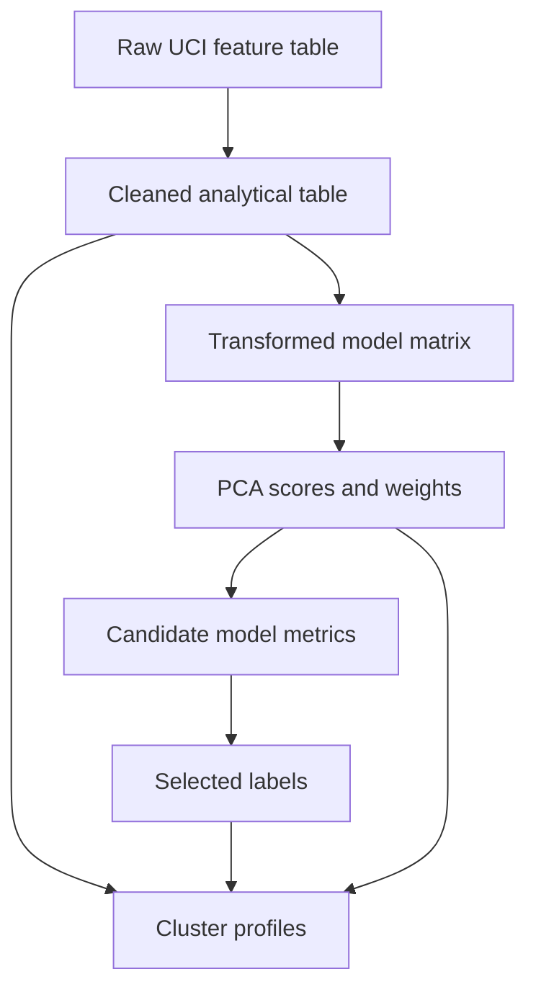

# Data Dictionary and Artifact Catalog

[Back to the project README](../README.md)

## Dataset

The project uses the Facebook Live Sellers in Thailand dataset from the UCI
Machine Learning Repository, dataset ID 488. The collected feature table
contains 7,050 posts and 11 source variables.

Source: [UCI Machine Learning Repository](https://archive.ics.uci.edu/dataset/488/facebook+live+sellers+in+thailand)

## Raw Data Dictionary

| Column | Type | Description | Modeling role |
| --- | --- | --- | --- |
| `status_type` | Categorical | Post format: link, photo, status, or video | One-hot encoded |
| `status_published` | Datetime text | Publication date and time | Parsed into temporal features |
| `num_reactions` | Integer | Reported total reactions | Interpretation only; excluded from matrix |
| `num_comments` | Integer | Comment count | Log-transformed and scaled |
| `num_shares` | Integer | Share count | Log-transformed and scaled |
| `num_likes` | Integer | Like reactions | Log-transformed and scaled |
| `num_loves` | Integer | Love reactions | Log-transformed and scaled |
| `num_wows` | Integer | Wow reactions | Log-transformed and scaled |
| `num_hahas` | Integer | Haha reactions | Log-transformed and scaled |
| `num_sads` | Integer | Sad reactions | Log-transformed and scaled |
| `num_angrys` | Integer | Angry reactions | Log-transformed and scaled |

## Engineered Fields

| Field | Description |
| --- | --- |
| `record_id` | Deterministic row identifier used to align all artifacts |
| `published_at` | Parsed publication timestamp |
| `publication_year` | Calendar year |
| `publication_month` | Calendar month from 1 to 12 |
| `publication_weekday` | English weekday name |
| `publication_weekday_number` | Monday-based weekday number from 0 to 6 |
| `publication_hour` | Hour plus minutes represented as a fraction |
| `*_sin`, `*_cos` | Cyclical encodings of month, weekday, and hour |
| `status_type_*` | One-hot status-type indicators |
| `PC1`–`PC10` | Retained principal-component scores |
| `cluster` | Selected model assignment; numeric labels are arbitrary |

## Tabular Artifacts

### Raw and intermediate datasets

| Path | Shape | Purpose |
| --- | ---: | --- |
| `data/raw/facebook_live_sellers.csv` | 7,050 × 11 | Validated source snapshot |
| `data/processed/facebook_posts_cleaned.csv` | 7,050 × 17 | Interpretable cleaned posts and temporal fields |
| `data/processed/facebook_posts_model_matrix.csv` | 7,050 × 20 | `record_id` plus 19 numeric modeling features |
| `data/processed/facebook_posts_pca.csv` | 7,050 × 11 | `record_id` plus 10 retained PCA scores |

### Dimensionality-reduction artifacts

| Path | Shape | Purpose |
| --- | ---: | --- |
| `data/processed/pca_explained_variance.csv` | 19 × 3 | Individual and cumulative explained variance |
| `data/processed/pca_component_weights.csv` | 19 × 11 | Input-feature weights for PC1–PC10 |

### Model-selection artifacts

| Path | Shape | Purpose |
| --- | ---: | --- |
| `data/processed/clustering_candidate_results.csv` | 122 × 17 | Metrics and eligibility for every candidate |
| `data/processed/clustering_model_comparison.csv` | 2 × 22 | Best eligible family candidates, stability, and selection |
| `data/processed/selected_cluster_labels.csv` | 7,050 × 2 | Final assignment for each `record_id` |

DBSCAN is absent from the family comparison because none of its current
candidates satisfies the configured eligibility policy.

### Interpretation artifacts

| Path | Shape | Purpose |
| --- | ---: | --- |
| `data/processed/cluster_profiles.csv` | 2 × 26 | Size, mean/median engagement, rank, and dominant content type |
| `data/processed/cluster_status_type_distribution.csv` | 8 × 4 | Content counts and shares within each cluster |
| `data/processed/cluster_temporal_profiles.csv` | 2 × 5 | Mean year, month, hour, and median hour |
| `data/processed/cluster_association_summary.csv` | 3 × 3 | Cramér's V for content and time categories |

## Fitted Objects

| Path | Object | Purpose |
| --- | --- | --- |
| `artifacts/preprocessor.joblib` | `ColumnTransformer` | Reproduce feature transformations |
| `artifacts/pca.joblib` | `PCA` | Transform the 19-feature matrix into 10 components |
| `artifacts/selected_clustering_model.joblib` | `AgglomerativeClustering` | Preserve the fitted selected solution |

The selected agglomerative estimator has no native method for assigning new
observations. The persisted object preserves the fitted training solution; it
is not a standalone online inference pipeline.

## Figure Catalog

| Figure | Purpose |
| --- | --- |
| `pca_explained_variance.png` | Component-selection diagnostic |
| `pca_component_weights.png` | Feature contributions to PCA components |
| `pca_projection_2d.png` | Unlabeled PC1/PC2 projection |
| `kmeans_search_diagnostics.png` | K-Means inertia and Silhouette search |
| `clustering_model_comparison.png` | Family-level metric comparison |
| `selected_cluster_sizes.png` | Selected-model balance diagnostic |
| `selected_clusters_pca_projection.png` | Cluster labels in the PC1/PC2 projection |
| `selected_model_silhouette.png` | Per-observation Silhouette distribution |
| `cluster_analysis_sizes.png` | Final cluster counts and shares |
| `cluster_engagement_profiles.png` | Relative engagement means |
| `cluster_status_type_distribution.png` | Content-format composition |
| `cluster_temporal_patterns.png` | Weekday and daypart distributions |
| `cluster_pca_centroids.png` | Cluster centroids in PCA space |

## Data Lineage

All joins downstream of preprocessing use `record_id`. The notebooks reject
duplicated identifiers, missing assignments, unexpected row counts, and
misaligned outputs.
