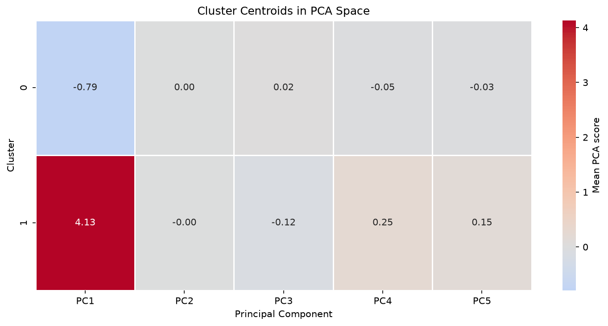
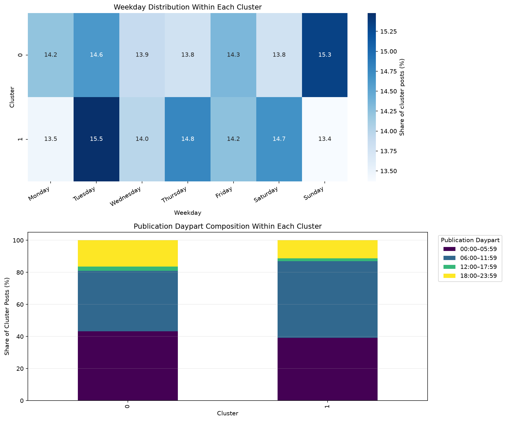

# Results, Interpretation, and Limitations

[Back to the project README](../README.md)

## Model-Selection Result

The search evaluates 122 configurations across three algorithm families.

| Algorithm | Candidates | Eligible candidates | Best observed Silhouette |
| --- | ---: | ---: | ---: |
| K-Means | 14 | 14 | 0.362 |
| Agglomerative Clustering | 84 | 19 | 0.627 |
| DBSCAN | 24 | 0 | 0.487 |

The best observed score is not automatically selected. Eligibility removes
solutions with insufficient cluster size, excessive concentration in one
group, or inadequate DBSCAN coverage.

The final family comparison selects Ward Agglomerative Clustering with two
clusters.

| Metric | Selected value |
| --- | ---: |
| Silhouette Score | 0.364 |
| Calinski–Harabasz Score | 2,346.17 |
| Davies–Bouldin Score | 1.342 |
| Mean perturbation ARI | 0.967 |
| Largest cluster share | 83.87% |
| Coverage | 100% |

The high ARI indicates assignment stability under the tested perturbations.
The moderate Silhouette Score and size imbalance show that the groups are not
equally separated market segments.

## PCA Result

Ten components preserve 87.79% of the total variance, exceeding the configured
85% threshold. PC1 alone explains 30.56% and is driven mainly by comments,
shares, love reactions, haha reactions, and wow reactions.

The selected high-engagement group has a strongly positive PC1 centroid, while
the larger lower-engagement group has a negative PC1 centroid. This supports
the behavioral interpretation produced from the original-scale profiles.

## Cluster Profiles

| Attribute | Cluster 0 | Cluster 1 |
| --- | ---: | ---: |
| Posts | 5,913 | 1,137 |
| Dataset share | 83.87% | 16.13% |
| Median reactions | 38 | 229 |
| Median comments | 2 | 709 |
| Median shares | 0 | 175 |
| Median core engagement | 40 | 1,113 |
| Dominant content type | Photo | Video |
| Dominant content share | 71.54% | 94.55% |

Cluster 0 represents the broad majority of posts and has low typical
conversational engagement. Cluster 1 is smaller, video-dominant, and exhibits
substantially higher comments and shares.

Numeric labels are arbitrary. Cluster 1 is not inherently better, and the
observed difference does not demonstrate that video format causes engagement.

## Categorical Associations

| Variable | Cramér's V | Descriptive strength |
| --- | ---: | --- |
| Status type | 0.573 | Strong |
| Publication daypart | 0.081 | Negligible |
| Publication weekday | 0.025 | Negligible |

Content format is the clearest categorical distinction. Weekday activity is
broadly distributed across both groups, and time-of-day differences are small
relative to the content and engagement contrasts.

## Relationship to the Legacy Notebook

The original academic notebook explored similar questions but used different
preprocessing, PCA retention, model configurations, and evaluation rules. Its
reported metrics should not be mixed with the refactored pipeline.

The values in the current notebooks and exported CSV files supersede the
legacy numerical conclusions because they are generated from the validated,
reproducible workflow documented in this repository.

## Limitations

- The source feature table does not contain seller or original post
  identifiers.
- Audience size, reach, impressions, paid promotion, topic, and campaign data
  are unavailable.
- Exact feature duplicates cannot be resolved confidently without identifiers.
- Engagement variables are strongly right-skewed and include viral outliers.
- Internal clustering metrics measure geometry, not business usefulness.
- The selected solution is imbalanced and has only moderate separation.
- Two-dimensional plots do not represent every relationship in the retained
  10-component space.
- The result reflects a specific group of Thai sellers and may not generalize
  to other markets or time periods.
- Agglomerative Clustering cannot natively assign future observations.

## Recommended Next Steps

1. Collect seller, reach, impression, audience, campaign, and paid-promotion
   attributes.
2. Validate the profiles with domain specialists and seller-level analysis.
3. Test content-format hypotheses through controlled experiments.
4. Monitor profile and cluster-balance drift as new posts are added.
5. Compare robust scaling, alternative PCA thresholds, and nonlinear
   representations without selecting from a two-dimensional visualization.
6. If future assignment is required, evaluate the stable K-Means alternative
   or train a supervised classifier on the selected labels.
7. Add automated notebook execution and artifact-contract checks to CI.
